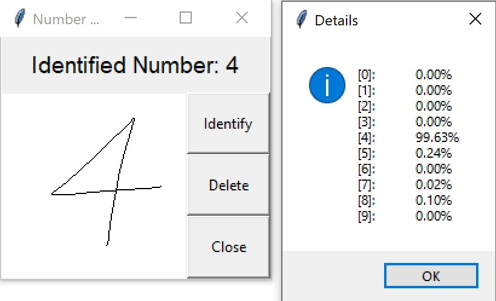

# Number_Identification
This repository is about identifying numbers with a neural network. Additionally a user interface is implemented, so that the user can draw a number and the program is predicting which number the user has drawn.

The repository is splitted into two parts. The first program which is creating the neural network, and the other one, that is offering the mentioned user interface.

## Model
The model uses Convolutional Neural Network (CNN) layers and archives an accuracy of 99.06% on the test dataset.

</img>
</img>

This jupyter notebook requrires the following modules:
- gzip
- numpy
- tensorflow
- keras
- sklearn
- seaborn
- pandas
- pickle
- matplotlib

## Main Program
The main program is using the model from the jupyter notebook. The user interface requires the module "Tkinter". The software is splitted into two classes: The main class, which is offering the user interface and handling the button clicks and the field class that is combining the canvas input and the neuronal network.

This program requires the following modules:
- tkinter
- numpy
- tensorflow
- keras

## Some Screenshots
</img>
</img>
</img>
</img>
</img>
</img>
</img>
</img>
</img>
</img>
</img>

Info: The detail-window can be accessed by clicking on the button "Identify".